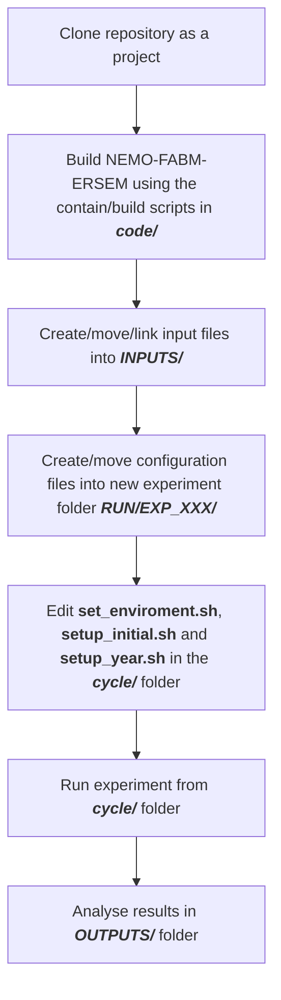

# NEMO_project_template

Repository containing the recommended folder structure for a NEMO-FABM-BGC project, including a set of scripts to handle automatic run cycling. Workflow is designed to follow this procedure:


## Repository structure/workflow

Clone repository for a specific project, for example, `NECCTON` rather than `NEMO_project_template`.

### Code

First, navigate to the `code/` directory and set the enviroment via `0_set_environment.sh`

We advise people to ue the singularity container to install NEMO-FABM-ERSEM. The scripts pull the container from the repository https://github.com/pmlmodelling/NEMO-container.

Alternatively, if singularity is not available the scripts to build NEMO-FABM-ERSEM are in the `archer_standalone/` directory.

### INPUTS

Next, populate the `INPUTS` folder, either by copying files or by creating symbolic links. The basic structure is as follows:
- <H4>DOM</H4> Includes domain files, coordinates, bathymetry and initial conditions
- <H4>LBC</H4> Folders for physics and BGC Lateral/open boundary conditions
- <H4>RIV</H4> Includes river forcing files
- <H4>SBC</H4> Folders for atmospheric forcing and BGC surface forcing
- <H4>TIDES</H4> Includes tidal forcing files

### RUN

Create a 'clean' set of run files in a reference folder within the RUN directory, normally `EXP00/`. This should include all input configuration files (namelists, xios xmls, fabm yaml and inputs). Also include runscript.slurm, generated on ARCHER by the mkslurm script. 

### cycle
Next edit 3 files within the `cycle/` directory. 
1. `set_environment.sh` includes environment variables runtime parameters and slurm variables.
2. `setup_initial.sh` creates the run environment and links all the files from `INPUTS/` that are needed for the full run (e.g. domain files)
3. `setup_year.sh` will link all the files needed for running a given year, such as LBCs and river files. 

More details are provided in `cycle/README.md`. After setting these files, the run is ready to be executed using the command 
```
    sbatch --export=year=$START_YEAR --export=month=01 cycle.slurm
```

### OUTPUTS

By default, output will be moved to the `OUTPUTS/` directory using the `YYYY/MM/` folder structure. 


