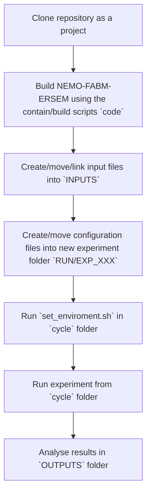

```mermaid
  graph TD;
        A[Clone repository as a project]-->B;
        B[Build NEMO-FABM-ERSEM using the contain/build scripts `code`]-->C;
        C[Create/move/link input files into `INPUTS`]-->D;
        D[Create/move configuration files into new experiment folder `RUN/EXP_XXX`]-->E;
        E[Run `set_enviroment.sh` in `cycle` folder]-->F;
        F[Run experiment from `cycle` folder]-->G;
        G[Analyse results in `OUTPUTS` folder]
```